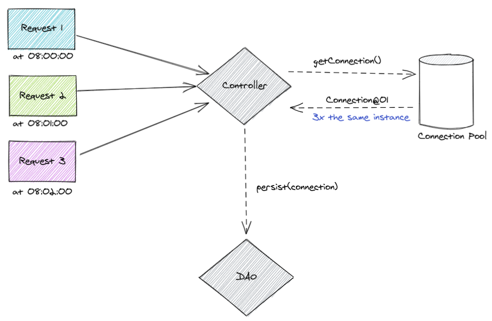

## CONSTRUÇÃO DE OBJETOS
Repositório com exemplos de códigos utilizados no workshop sobre boas práticas na construção de objetos.

### Contextualização:
No mundo da programação, quase tudo gira em torno de comunicação, escrever um bom código é primordial para ser fácil de se utilizar e manter. Com isso em mente, temos que minimizar ao máximo o risco de erros por conta de confusão no momento de evoluir o código fonte. Somando esse contexto às boas práticas de OOP, devemos sempre utilizar domínios com comportamento (evitar anti-pattern [AnemicDomainModel](https://www.martinfowler.com/bliki/AnemicDomainModel.html)). 

### Static Factory Method - cache de instâncias
Uma das vantagens de métodos de fabricação estáticos é que eles não precisam retornar uma nova instância a cada chamada, ou seja, é possível "cachear" objetos de maneira transparente para o código que irá criar o objeto. 

<b>Quando utilizar</b>: Em casos em que o objeto a ser criado é pesado e/ou que ele pode ser compartilhado durante as threads do sistema.

<b>Exemplo</b>: Pool de conexões com o banco de dados. A criação de uma conexão é uma operação custosa para a aplicação, portanto, faz sentido se ter uma forma de reaproveitar as instâncias dessas conexões.

 

##### DataSource:
```java

```

##### Sempre a mesma instância:
```java

```


###### Observação: O exemplo apresentado foi criado especificamente com o objetivo de demonstrar a utilização de métodos de fábrica estático reaproveitando as instâncias. No mundo real as mesmas condições não se aplicam. O importante é entender uma forma de como implementar um código que consiga reaproveitar e/ou fazer um cache de instâncias de um determinado objeto sem que a pessoa que irá consumir esse código precise se preocupar com isso. 